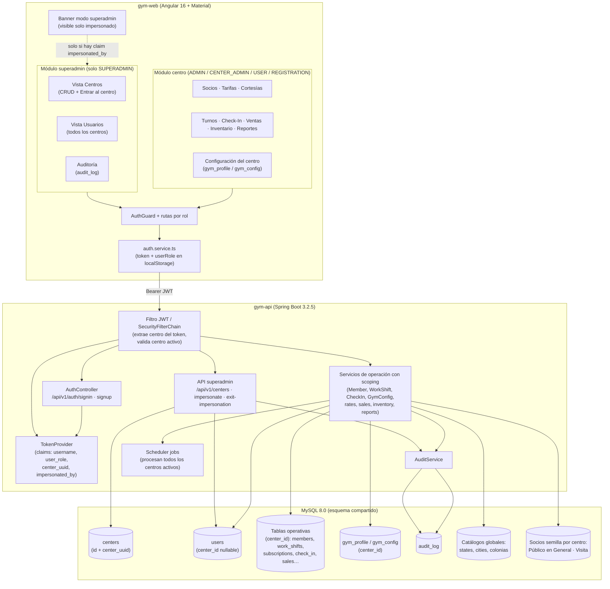
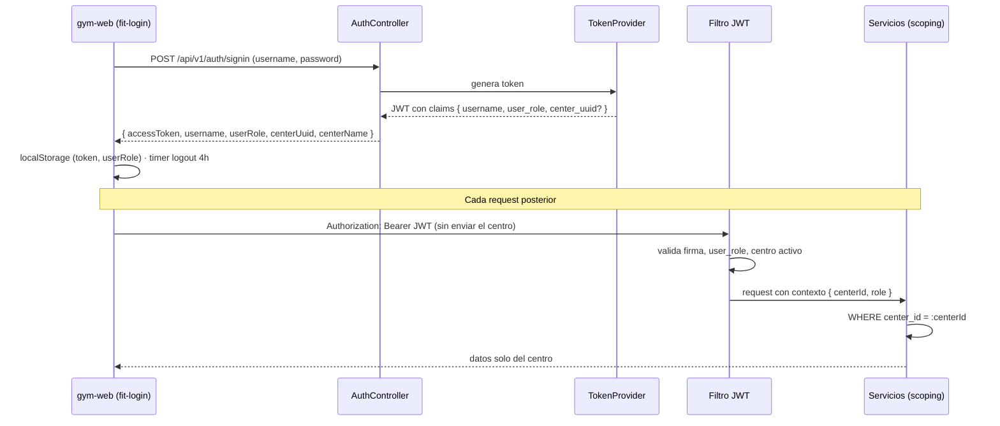
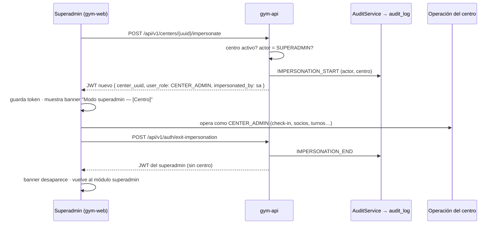
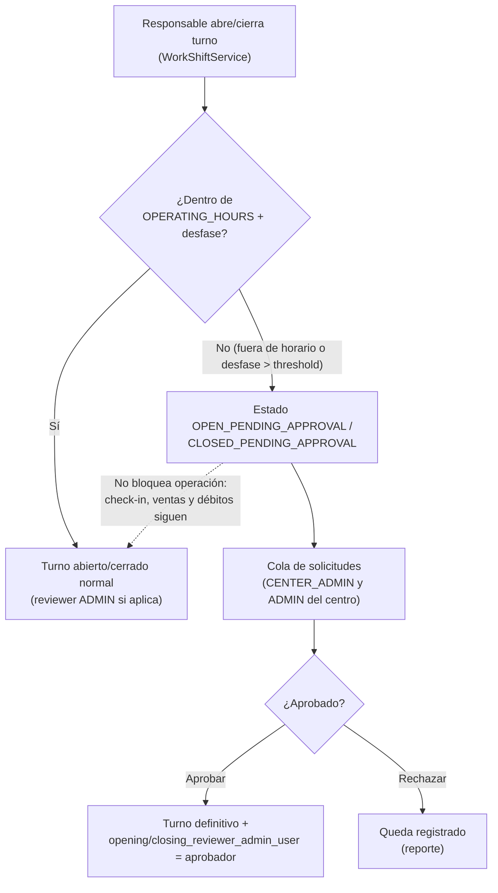
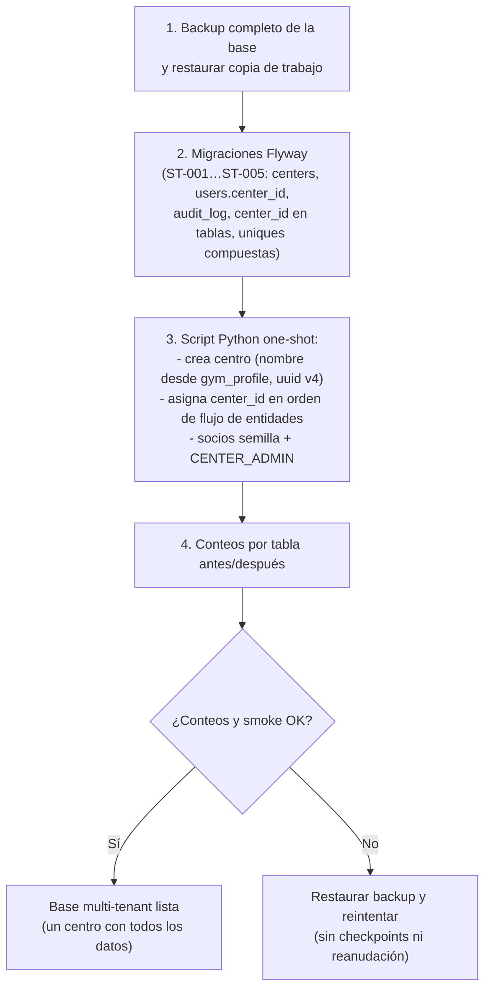

# Diagramas — Conversión de FitRoom a SaaS multi-tenant

Referencias: [ADRs](./adr/) · [Stories](./stories/)

## 1. Componentes (vista general)

## 2. Flujo: login y claim de centro en el JWT

El superadmin entra al login igual, pero su token **no lleva** `center_uuid`; solo
puede llamar a la API de superadmin (ST-006) o impersonar (ST-009).

## 3. Flujo: impersonación de centro

Bloqueos mientras impersonado: crear/editar `CENTER_ADMIN`/`SUPERADMIN`, ver
auditoría, impersonar de nuevo.

## 4. Flujo: apertura/cierre de turno fuera de horario

## 5. Flujo: migración one-shot a multi-tenant

Orden de asignación de `center_id` (ADR-0007): `centers` → `users` →
`gym_profile`/`gym_config` → `members` (+ `member_status`, fingerprints) →
`rates`/artículos → turnos → débitos → suscripciones/cortesías → check-in/out →
ventas/compras → historiales y tablas de relación.